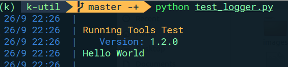
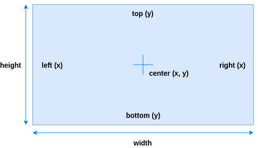

# k-util
[](https://travis-ci.org/krinj/k-util) [](https://codecov.io/gh/krinj/k-util) 

Some of the most common, general purpose utility scripts that I use across my Python AI and CV projects.


## Contents

1. [Core](#core)
2. [Logger](#logger)
3. [Pather](#pather)
4. [Region](#region)
5. [Serializable](#serializable)


## Core

There's often a need for me to do some simple math without needing a more full-on library like Numpy. Mostly to do with interpolation and filtering.

Here are the method signatures.

```python
# Linear interpolation between two values.
def interpolate(f1: float, f2: float, factor: float) -> float:
    pass

# Linear interpolation between two colors.
def interpolate_color(c1, c2, factor: float) -> list:
    pass

# Filter between two values (for smoothing, etc).
def filter_value(old: float, new: float, factor: float) -> float:
    pass
```


## Logger

I've created a more comprehensive logging tool, similar to the native Python logger. The motivation for this tool was to have clean, visually meaningful logging capabilities. All lines are logged in color (which can be disabled) and prefixed with a simple time and date display. There is a special focus on formatting, with support for field inputs, headers, line breaks, and indents.



To get the above output, you can run:

```python
Logger.header("Running Tools Test")
Logger.field("Version", "1.2.0")
Logger.log("Hello World")
Logger.line_break()
```

The logger supports both static functions (via a singleton), or instance functions.

```python
# Singleton example.
Logger.log("Hello World")

# Instance example.
logger = Logger()
logger.log("Hello World")
```

The instance pattern is useful if you want to create different distinct loggers for separate modules. Each logger instance (or even the singleton) can have custom logging functions attached.

```python
def custom_log_action(message: str, is_error: bool):
	print(message)

Logger.add_action(tag="custom_action", action=custom_log_action)
```

The most common case for this is if we want to write to a file. For that, there is a special function to directly attach a file to a logger (works on both instance and singleton loggers).

```python
# Will mirror all log output, minus colors, to 'my_output.log.'
Logger.attach_file_handle(path=".", main_name: str="my_output")
```


## Pather

This is basically a one-liner to create a path recursively, similar to `os.makedirs`. It adds a few new functionalities. I typically use this to set up or clear all the directories for AI training and testing.

```python
# Create these directories recursively (if they do not already exist).
pather.create("foo/bar/dir")

# If you pass in a file instead of a directory, it will do the same thing.
pather.create("foo/bar/dir/img.png")

# This will also clear everything in the 'dir' directory (if it exists).
pather.create("foo/bar/dir", clear=True)
```


## Region

The Region is a wrapper for an arbitary rectangular area. I commonly use this to specify a bounding box on an image.



The motivation for creating this class is to have a geometric data structure that has meaningful properties (x, y, left, right, etc) as well as having all of these attributes sync up when any one of them is edited.

The region has a couple of useful built-in functions as well.

```python
# Create a region.
region = Region(left=0, right=200, top=0, bottom=100)

# Get the biggest edge.
region.biggest_edge  # Should return 200

# Get the region area.
region.area  # Should return 20000

# Expands the region to a fixed ratio. Result should be 200x200.
region.expand_to_ratio(aspect_ratio=1.0)

# Distance between two regions.
Region.distance(r1, r2)
```


## Serializable

This is an abstract base class meant for objects that need JSON serialization. This is useful if you need to prototype quickly and write data on-the-go in a format that works well with other applications. It is not the most efficient or scalable solution. If you want a full fledged, efficient, x-platform serialization protocol, check out [Google's ProtoBuf](https://developers.google.com/protocol-buffers/).

The subclasses must implement the `encode` and `decode` methods, which essentially convert your choice of attributes to a `dict` (and back). Note that the decode is a class method which returns an instance of that class.

There are also methods to write and read an object directly to file.

```python
# Foo extends Serializable.
foo = Foo()

# Save Foo as a JSON file.
foo.write_to_file("foo.json")

# Load a new Foo instance from the file.
new_foo = Foo.load_from_file("foo.json")
```
